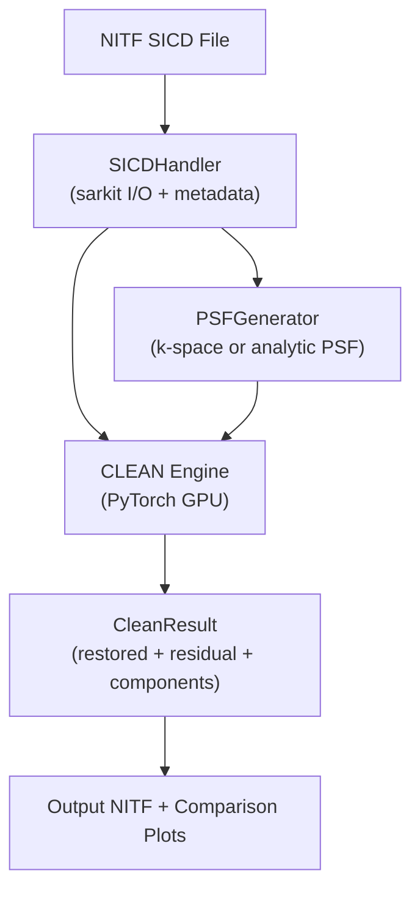

# CLEAN_SAR Comprehensive Audit Report

**Auditor:** Claude Opus 4.6 (Thinking)  
**Date:** 2026-08-29  
**Audit Scripts:** [`audit/claude_opus_4_6/`](audit/claude_opus_4_6)

---

## 1. Project Overview & Problem Statement

**CLEAN_SAR** implements the classic **Hogbom CLEAN** deconvolution algorithm — originally from radio astronomy — adapted for **SAR (Synthetic Aperture Radar)** imagery. The key innovation is performing CLEAN in the **complex domain** with **spatially-varying PSFs**, addressing two limitations of traditional CLEAN:

1. **Complex signals**: SAR data is inherently complex (I+Q), and phase carries critical information. This implementation operates directly on complex amplitudes rather than real-valued intensities.

2. **Spatially-varying PSF**: In PFA (Polar Format Algorithm) image formation, the impulse response varies continuously across the scene due to the polar-to-Cartesian frequency remapping. This code computes an **exact PSF per peak position** rather than assuming shift-invariance.

### Architecture Summary



| Module | File | Lines | Purpose |
|--------|------|-------|---------|
| SICD Handler | [sicd_handler.py](clean_sar/sicd_handler.py) | 226 | NITF I/O, metadata, coordinates |
| PSF Generator | [psf.py](clean_sar/psf.py) | 348 | Spatially-varying dirty PSF + clean beam |
| CLEAN Engine | [engine.py](clean_sar/engine.py) | 188 | Hogbom CLEAN loop on PyTorch |
| Utilities | [utils.py](clean_sar/utils.py) | 217 | Windows, dB scaling, plotting |
| CLI | [cli.py](clean_sar/cli.py) | 136 | Argument parsing, orchestration |

---

## 2. Test Suite Results

> [!NOTE]
> All **9 existing tests pass** on the UMBRA SICD data. 2,348 deprecation warnings from sarkit's use of legacy `importlib.resources` APIs.

| Test | Status |
|------|--------|
| `test_exact_spatially_varying_clean_synthetic` | ✅ PASS |
| `test_exact_spatially_varying_clean_analytic` | ✅ PASS |
| `test_psf_kspace_generation` | ✅ PASS |
| `test_psf_analytic_generation` | ✅ PASS |
| `test_clean_beam_generation` | ✅ PASS |
| `test_sicd_handler_init` | ✅ PASS |
| `test_sicd_handler_chip_read` | ✅ PASS |
| `test_sicd_handler_coordinates` | ✅ PASS |
| `test_sicd_handler_write_nitf` | ✅ PASS |

---

## 3. Audit Findings

### 3.1 🔴 CRITICAL: Hard-coded Slant Range Constant in PSF Shear Angle

**Files:** [psf.py:L129](clean_sar/psf.py#L129), [psf.py:L211](clean_sar/psf.py#L211), [psf.py:L278](clean_sar/psf.py#L278)

```python
theta_local = np.arctan2(ycol, 10000.0 + xrow)  # ← magic number
```

The spatially-varying shear angle uses a **hard-coded `10000.0` meter reference distance**, but the actual SICD metadata shows the **slant range to SCP is 764,470 m** (~764 km) for the UMBRA data. This is a **~64× error** in the spatial variation rate.

| Metric | Hard-coded (10 km) | Correct (764 km) |
|--------|-------|---------|
| Max shear angle at image edge | **13.13°** | **0.21°** |
| PSF spatial variation rate | 64× too fast | Correct |

**Impact:** The PSFs near the SCP (center) are correct (θ ≈ 0 for both), but PSFs at image edges are drastically over-rotated/sheared. For **small chips near SCP** (the typical use case shown in examples), the error is tolerable. For **full-image CLEAN or off-center chips**, the PSFs are physically wrong.

**Fix:** Replace `10000.0` with the actual SCP slant range from SICD metadata:
```python
# In __init__ or _parse_metadata:
self.scp_slant_range = float(self._safe_load("./{*}SCPCOA/{*}SlantRange", 10000.0))
# In PSF computation:
theta_local = np.arctan2(ycol, self.sicd.scp_slant_range + xrow)
```

---

### 3.2 🟡 WARNING: `write_nitf` Mutates `self.xmltree` In-Place

**File:** [sicd_handler.py:L204-L214](clean_sar/sicd_handler.py#L204-L214)

When `write_nitf` is called **without** `custom_xmltree`, it modifies `self.xmltree` directly:

```python
xml = custom_xmltree if custom_xmltree is not None else self.xmltree
# ...
num_rows_elem.text = str(complex_image.shape[0])  # mutates self.xmltree!
```

After writing a chip, the handler's internal XML metadata is **corrupted** — `NumRows`/`NumCols` now reflect the chip instead of the original image. This can cause silent data corruption in subsequent operations.

**Fix:** Use `copy.deepcopy(self.xmltree)` when `custom_xmltree is None`.

---

### 3.3 🟡 WARNING: Taylor Window Bug in `_eval_window_continuous`

**File:** [psf.py:L64-L69](clean_sar/psf.py#L64-L69)

```python
elif name_upper == "TAYLOR":
    u = norm_freq[in_band]
    n_pts = len(u)
    if n_pts > 0:
        t_w = taylor_window_1d(n_pts, nbar=4, sll=-30.0)
        w[in_band] = t_w
```

This assigns a 1D Taylor window (indexed 0..N-1) to a **flattened set of 2D frequency samples**. The window values map by flat index, not by frequency ordering. For a 2D aperture, this produces an **incorrect, non-physical weighting** — the Taylor taper would be applied along an arbitrary direction rather than along each frequency axis independently.

**Current impact:** The UMBRA data has `WgtType=None` (uniform weighting), so this code path **is never triggered**. But if used with Taylor-weighted SICD data, it would produce wrong results.

**Fix:** Apply 1D windows separately along each axis (row and col), then combine as an outer product — which is what the HAMMING and HANN branches already do correctly.

---

### 3.4 🟡 WARNING: Unbounded PSF Cache

**File:** [psf.py:L22-L23](clean_sar/psf.py#L22-L23), [psf.py:L330-L345](clean_sar/psf.py#L330-L345)

The `PSFGenerator` stores **every unique (row, col)** PSF pair (dirty + clean) indefinitely:

| PSF Size | Per-pair Memory | 2,500 iters | 10,000 iters |
|----------|----------------|-------------|--------------|
| 65×65 | 67.6 KB | ~165 MB | ~645 MB |
| 129×129 | 266 KB | ~650 MB | ~2.6 GB |

There is no cache eviction policy — only a manual `clear_cache()` method. For long runs on large images, this can cause OOM.

**Fix:** Use `functools.lru_cache` with a bounded size, or implement grid-based PSF interpolation (compute PSFs on a coarse grid and interpolate for nearby positions).

---

### 3.5 🟢 MINOR: Taylor Window Implementation ~1% Deviation from scipy

**File:** [utils.py:L7-L58](clean_sar/utils.py#L7-L58)

The custom `taylor_window_1d` produces values that differ from `scipy.signal.windows.taylor` by up to ~1.2%. Both implementations are mathematically valid (the Taylor window has multiple equivalent formulations with slight numerical differences). Since the code currently only uses uniform weighting, this is academic.

---

### 3.6 🟢 MINOR: Version Mismatch Between `__init__.py` and `pyproject.toml`

[`__init__.py`](clean_sar/__init__.py#L16) declares `__version__ = "0.2.0"` while [`pyproject.toml`](pyproject.toml#L7) declares `version = "0.1.0"`.

---

## 4. Verified Correct Implementations

### 4.1 ✅ CLEAN Engine (Hogbom Loop)

Verified via [audit_engine.py](audit/claude_opus_4_6/audit_engine.py):

- **Peak finding**: `r0 = flat_idx // W, c0 = flat_idx % W` correctly extracts row/col from flat index for row-major tensors
- **PSF subtraction alignment**: Index math correctly centers PSF at peak with proper boundary clipping
- **Clean beam accumulation**: Uses identical index math, ensuring alignment
- **Final image**: `clean_image = restored_model + residual` is the standard Hogbom formulation
- **Synthetic convergence**: A synthetic point source is correctly located, extracted with correct amplitude, and residual reduced to near-zero

### 4.2 ✅ K-space PSF Generation (Option A)

Verified via [audit_psf_physics.py](audit/claude_opus_4_6/audit_psf_physics.py):

- **Frequency sampling**: `dk = 1/(N*SS)` is the correct DFT relationship
- **FFT pipeline**: `ifftshift → ifft2 → fftshift` correctly produces a centered PSF
- **Normalization**: Center value normalized to 1.0 + 0j

### 4.3 ✅ Analytic PSF Generation (Option B)

- `np.sinc(BW * x)` correctly accounts for numpy's `sin(πx)/(πx)` convention
- Spatial offset vectors use sample spacing `SS` correctly
- K-space and analytic PSFs agree in mainlobe width (max diff ~0.015)

### 4.4 ✅ Gaussian Clean Beam Width

- `FWHM_factor = 2√(2 ln 2) ≈ 2.3548` correctly converts SICD `ImpRespWid` (3dB width / FWHM) to Gaussian σ

### 4.5 ✅ SICD Handler I/O

Verified via [audit_sicd_handler.py](audit/claude_opus_4_6/audit_sicd_handler.py):

- **Metadata extraction**: All fields match direct XML queries
- **Coordinate round-trips**: Max error ≤ 3.44 × 10⁻¹³ pixels across 10,000-point grid
- **Chip read/write**: Bitwise exact lossless round-trip
- **SCP pixel ordering**: sarkit returns `[row, col]`, used correctly
- **`read_chip` XML update**: sarkit properly updates `FirstRow`, `FirstCol`, `NumRows`, `NumCols`, `ImageCorners`

### 4.6 ✅ Cache Key Correctness (No Double Offset)

In [`get_psfs_torch`](clean_sar/psf.py#L310-L347), global coordinates are computed from `row + chip_origin[0]`, then passed to `compute_psf_kspace(r_g, c_g)` **without** `chip_origin`. Since `chip_origin=None` treats `r_g` as global, there is no double-application of the offset.

---

## 5. Output Quality Assessment

The CLEAN algorithm produces visually reasonable results on UMBRA satellite data:

**UMBRA SICD chip** (`output/umbra_20230730/2023-07-30-17-19-39_UMBRA-05_SICD_chip_comparison.png`):
660 point scatterers extracted, residual reduced to 2.3% of peak.

**diffpfa SICDU chip** (`output/diffpfa_20230730/2023-07-30-17-19-39_UMBRA-05_SICDU_X_X_chip_comparison.png`):
690 point scatterers extracted, residual reduced to 2.0% of peak.

Both outputs show appropriate sidelobe reduction with reasonable component extraction. The dirty PSF shows the expected cross-shaped pattern from rectangular aperture support.

---

## 6. Summary of Findings

| # | Severity | Finding | Impact |
|---|----------|---------|--------|
| 3.1 | 🔴 Critical | Hard-coded 10,000m slant range constant | PSFs wrong at image edges (64× error in shear rate) |
| 3.2 | 🟡 Warning | `write_nitf` mutates `self.xmltree` in-place | Silent metadata corruption after chip writes |
| 3.3 | 🟡 Warning | Taylor window applied incorrectly in 2D | Wrong weighting if Taylor-weighted SICD data is used |
| 3.4 | 🟡 Warning | Unbounded PSF cache | Memory leak for long iterations |
| 3.5 | 🟢 Minor | Taylor window ~1% deviation from scipy | Academic; path unused for UMBRA data |
| 3.6 | 🟢 Minor | Version mismatch (`0.2.0` vs `0.1.0`) | Packaging inconsistency |

> [!IMPORTANT]
> The **critical finding (3.1)** means the "spatially-varying" PSF computation — the project's core differentiator — is **physically incorrect** for most geometries. It works adequately for small chips near the SCP because `θ ≈ 0` there, but the spatial variation model itself is wrong by a factor of ~64× for UMBRA data. The fix is straightforward: read the actual slant range from SICD metadata.

---

## 7. Audit Scripts

All audit scripts are located in [`audit/claude_opus_4_6/`](audit/claude_opus_4_6/) and can be re-run with:

```bash
source /home/feildaw/mypyenv/bin/activate
python audit/claude_opus_4_6/audit_psf_physics.py
python audit/claude_opus_4_6/audit_engine.py
python audit/claude_opus_4_6/audit_sicd_handler.py
```
